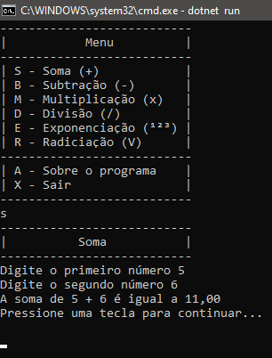
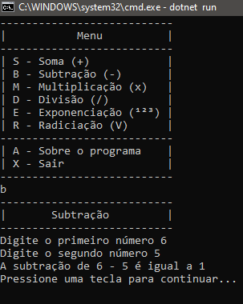
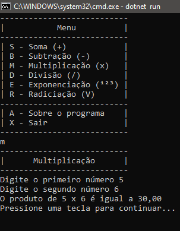
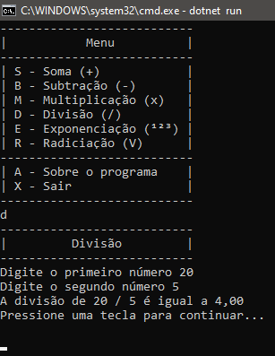
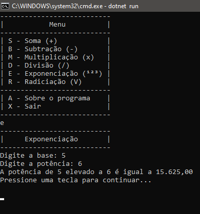
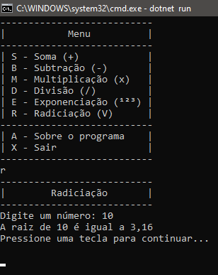

# PROJETO

O programa exibe as funcionalidades das operações aritiméticas.

## _SCREENSHOT_

```
Execulta a SOMA.
```


## _SCREENSHOT_

```
Execulta a SUBTRAÇÃO.
```


## _SCREENSHOT_

```
Execulta a MULTIPLICAÇÃO.
```


## _SCREENSHOT_

```
Execulta a DIVISÃO.
```


## _SCREENSHOT_

```
Execulta a EXPONENCIAÇÃO.
```


## _SCREENSHOT_

```
Execulta a RADICIAÇÃO.
```


---

## _DOWNLOAD_

<b>Baixe o arquivo e descompacte na pasta desejada.</b>

[📌 Download do arquivo .zip](dist/Projeto-Final.zip)

Execulte utlizando o comando

```
dotnet ProjetoFinal.dll
```
_WINDOWS_

````
Apenas de um duplo-click
````
---
Todos os direitos reservados - Pirataria é crime.