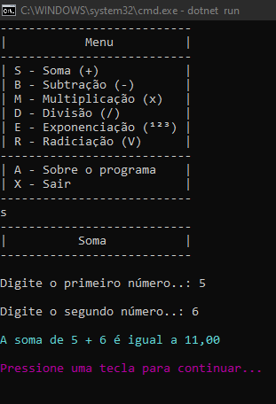
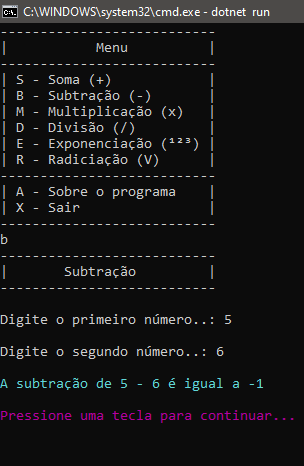
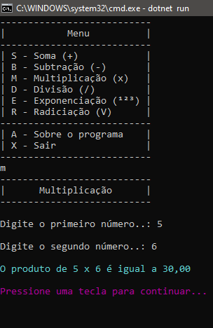
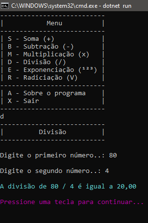
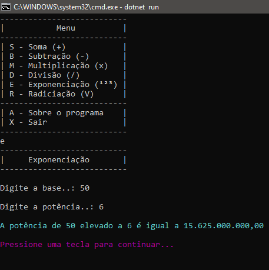
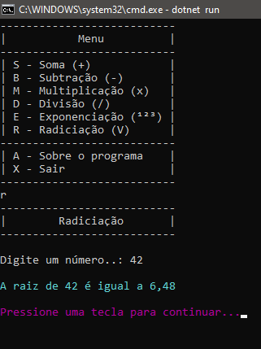

# PROJETO FINAL 
## 1º SEMESTRE DE PROGRAMAÇÃO
---

O programa exibe as funcionalidades das operações <b>_aritméticas_</b>.

### _SCREENSHOT_

```
Executa a SOMA.
```


### _SCREENSHOT_
```
Executa a SUBTRAÇÃO.
```


### _SCREENSHOT_

```
Executa a MULTIPLICAÇÃO.
```


### _SCREENSHOT_

```
Executa a DIVISÃO.
```


### _SCREENSHOT_

```
Executa a EXPONENCIAÇÃO.
```


### _SCREENSHOT_

```
Executa a RADICIAÇÃO.
```


---

## _DOWNLOAD_

<b>Baixe o arquivo e descompacte na pasta desejada.</b>

[📌 Download do arquivo .zip](dist/Projeto-Final.zip)

Execute utlizando o comando abaixo.

```
dotnet ProjetoFinal.dll
```
_PARA WINDOWS_

````
Apenas dê um duplo click
````
---
<b>AGRADECIMENTOS</b>
 
📍[- Etec Adolpho Berezin](http://eteab.com.br/cms/)

📍[- Ermogenes Palacio](https://github.com/ermogenes)

📍[- Diego Neri](https://github.com/diegoneri)

📍[- Dev C#](https://ermogenes.github.io/aulas-programacao-csharp/)

---
Todos os direitos reservados - Pirataria é crime.